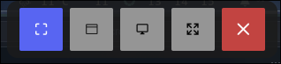

# crop-hypr

Hyprland向けに作られた、高速なRust製スクリーンショットツール。

## 特徴

- **即時キャプチャ**: 範囲、アクティブウィンドウ、フォーカス中モニター、全モニターを撮影
- **Portalキャプチャ**: xdg-desktop-portal のソースピッカー経由で任意のウィンドウ/モニターを選択
- **フリーズモード**: 画面を凍結し、オーバーレイUIで対話的に撮影対象を選択（Windowsの Win+Shift+S に近い操作感）
- `wl-copy` によるクリップボード自動コピー
- 成功/失敗のデスクトップ通知
- 保存先、ファイル名パターン、フリーズツールバーのグリフ・表示位置、ウィンドウ枠の取り込み、フリーズモード全体のUIカラーテーマを設定可能

## 必要要件

以下のツールが `$PATH` から実行できる状態が必要です。

| ツール | 用途 |
| ---- | ---- |
| `slurp` | 範囲選択（cropモード） |
| `wl-copy` | Waylandクリップボードへ画像をコピー |
| `notify-send` | デスクトップ通知（任意） |

画面キャプチャは **`zwlr_screencopy_manager_v1`** Waylandプロトコルでネイティブに実行されます（Hyprland / sway など wlroots 系コンポジター対応）。

ウィンドウ・モニター情報は **Hyprland IPCソケット**
（`$XDG_RUNTIME_DIR/hypr/<sig>/.socket.sock`）から直接取得します。

> [!CAUTION]
> フリーズモードのデフォルトグリフ表示には [Nerd Font](https://www.nerdfonts.com/) が必要です。アイコンは設定ファイルで変更できます。[設定](#設定)を参照してください。

## インストール

```sh
git clone https://github.com/ry2x/crop-hypr.git
cd crop-hypr
cargo build --release
cp target/release/crop-hypr ~/.local/bin/
```

### Arch Linuxユーザー向け

ArchパッケージをビルドするためのPKGBUILDが同梱されています。

```sh
git clone https://github.com/ry2x/crop-hypr.git
cd crop-hypr
makepkg -si
```

## 使い方

```sh
crop-hypr [--config <FILE>] <SUBCOMMAND>
```

| サブコマンド | 説明 |
| ---------- | ---- |
| `crop` | `slurp` で範囲選択して撮影 |
| `window` | アクティブウィンドウを撮影（Hyprland IPCのジオメトリを使用） |
| `portal` | xdg-desktop-portal のソースピッカーで選択して撮影 |
| `monitor` | フォーカス中モニターを撮影 |
| `all` | 全モニターを撮影 |
| `freeze` | 画面を凍結して対話的に選択 |
| `generate-config` | デフォルト設定ファイルを出力 |

### グローバルオプション

`--config <FILE>` / `-c <FILE>`: 既定パスではなく任意の設定ファイルを読み込みます。
すべてのサブコマンド（`generate-config` 含む）で利用できます。

```sh
crop-hypr --config ~/.config/crop-hypr/work.toml freeze
```

### フリーズモード

フリーズモードでは画面全体にオーバーレイを表示し、ツールバーから撮影方式を切り替えられます。



| モード | 動作 |
| ---- | ---- |
| Crop | ドラッグで任意矩形を作成 |
| Window | ウィンドウにホバーしてクリック |
| Monitor | モニターにホバーしてクリック |
| All | 画面全体を即時撮影 |
| Close | キャンセル（Escapeと同じ） |

アイコングリフは設定ファイルで変更可能です。[設定](#設定)を参照してください。

**キーボード:** `Escape` でキャンセル終了。

### Hyprland キーバインド例

```ini
# ~/.config/hypr/hyprland.conf
bindd = SUPER, S, ScreenshotMonitor,    exec, crop-hypr monitor
bindd = SUPER SHIFT, S, FreezeMode,     exec, crop-hypr freeze
bindd = , Print, ScreenshotFull,        exec, crop-hypr all
```

## 設定

設定ファイルの既定場所: `~/.config/crop-hypr/config.toml`

デフォルト設定は以下で生成できます。

```sh
crop-hypr generate-config
# 既存ファイルを上書きする場合:
crop-hypr generate-config --force
# 任意パスへ出力する場合:
crop-hypr --config ~/my-config.toml generate-config
```

### 設定サンプル

```toml
# スクリーンショットを保存するディレクトリ
# 既定値: ~/Screenshots
save_path = "~/Pictures/Screenshots"

# strftimeパターンで指定するファイル名（拡張子なし .pngは自動付与されます）
# 既定値: "hyprsnap_%Y%m%d_%H%M%S"
filename_pattern = "screenshot_%Y-%m-%d_%H-%M-%S"

# フリーズモードのツールバーを表示する画面の端。
# 選択肢: "top" | "bottom" | "left" | "right"  (既定値: "top")
toolbar_position = "top"

# trueの場合、ウィンドウキャプチャ（即時`window`コマンドとフリーズモードのWindow選択）に
# Hyprlandのウィンドウ枠を含めます。`general:border_size`分だけ各辺を拡張してキャプチャします。
# フリーズモードのオーバーレイでは`decoration:rounding`に合わせた角丸のハイライト枠を表示します。
# 既定値: false
# capture_window_border = false

# フリーズモードのツールバーに表示されるグリフ。
# 既定値はNerd Fontが必要です。必要に応じて個別のアイコンを上書きしてください。
[freeze_glyphs]
crop    = "󰆟"
window  = ""
monitor = "󰍹"
all     = "󰁌"
cancel  = "󰖭"

# ── フリーズモード UI カラー ──────────────────────────────────────────────────
# 色は [赤, 緑, 青, 不透明度] の浮動小数点配列で、各値は 0.0〜1.0 の範囲です。
# すべてのキーは省略可能で、省略した場合は以下の既定値が使用されます。

# [freeze_colors.overlay]
# background = "#00000059"     # 凍結画面上のディム

# [freeze_colors.toolbar]
# background = "#141414D9"  # ツールバーの背景

# [freeze_colors.button]
# idle_background   = "#333333FF"
# idle_text         = "#E6E6E6FF"
# active_background = "#5865F2FF"
# active_text       = "#FFFFFFFF"
# hover_background  = "#6B79F5FF"
# hover_text        = "#FFFFFFFF"

# [freeze_colors.cancel_button]
# idle_background  = "#C3423FFF"
# idle_text        = "#FFFFFFFF"
# hover_background = "#D44A47FF"
# hover_text       = "#FFFFFFFF"

# [freeze_colors.window_frame]
# fill_idle      = "#4585FF33"
# fill_hovered   = "#4585FF8C"
# stroke_idle    = "#4D99FFB3"
# stroke_hovered = "#4D99FFFF"
# label_text     = "#FFFFFFFF"
# hint_text      = "#CCE6FFE6"  # "Click to capture"

# [freeze_colors.monitor_frame]
# fill_idle      = "#4585FF14"
# fill_hovered   = "#4585FF66"
# stroke_idle    = "#4D99FF59"
# stroke_hovered = "#4D99FFFF"
# label_text     = "#FFFFFFFF"
# hint_text      = "#CCE6FFE6"  # "Click to capture"
# name_text_idle = "#FFFFFF80"  # ホバーしていないときのモニター名  # ホバーしていないときのモニター名

# [freeze_colors.crop_frame]
# stroke     = "#FFFFFFFF"
# label_text = "#FFFFFFFF"      # "W × H" サイズラベル
```

### 設定項目リファレンス

| キー | 型 | 既定値 | 説明 |
| --- | --- | --- | --- |
| `save_path` | path | XDG Pictures ディレクトリ + `/Screenshots`（fallback: `$HOME/Screenshots`） | 保存先ディレクトリ |
| `filename_pattern` | string | `hyprsnap_%Y%m%d_%H%M%S` | ファイル名のstrftimeパターン（拡張子なし） |
| `toolbar_position` | string | `top` | フリーズツールバーの表示位置: `top`, `bottom`, `left`, `right` |
| `capture_window_border` | bool | `false` | ウィンドウキャプチャにHyprlandのウィンドウ枠を含める。フリーズモードでは角丸ハイライト枠も表示 |
| `freeze_glyphs.crop` | string | `󰆟` (U+F019F) | cropモードのアイコン |
| `freeze_glyphs.window` | string | `` (U+EB7F) | windowモードのアイコン |
| `freeze_glyphs.monitor` | string | `󰍹` (U+F0379) | monitorモードのアイコン |
| `freeze_glyphs.all` | string | `󰁌` (U+F004C) | allモードのアイコン |
| `freeze_glyphs.cancel` | string | `󰖭` (U+F05AD) | cancelボタンのアイコン |
| `freeze_colors.overlay.background` | string (hex) | `"#00000059"` | 凍結画面上のディムフィル |
| `freeze_colors.toolbar.background` | string (hex) | `"#141414D9"` | ツールバー背景 |
| `freeze_colors.button.idle_background` | string (hex) | `"#333333FF"` | モードボタン・非選択時の背景 |
| `freeze_colors.button.idle_text` | string (hex) | `"#E6E6E6FF"` | モードボタン・非選択時のテキスト |
| `freeze_colors.button.active_background` | string (hex) | `"#5865F2FF"` | モードボタン・選択時の背景 |
| `freeze_colors.button.active_text` | string (hex) | `"#FFFFFFFF"` | モードボタン・選択時のテキスト |
| `freeze_colors.button.hover_background` | string (hex) | `"#6B79F5FF"` | モードボタン・ホバー時の背景 |
| `freeze_colors.button.hover_text` | string (hex) | `"#FFFFFFFF"` | モードボタン・ホバー時のテキスト |
| `freeze_colors.cancel_button.idle_background` | string (hex) | `"#C3423FFF"` | キャンセルボタン・通常背景 |
| `freeze_colors.cancel_button.idle_text` | string (hex) | `"#FFFFFFFF"` | キャンセルボタン・通常テキスト |
| `freeze_colors.cancel_button.hover_background` | string (hex) | `"#D44A47FF"` | キャンセルボタン・ホバー背景 |
| `freeze_colors.cancel_button.hover_text` | string (hex) | `"#FFFFFFFF"` | キャンセルボタン・ホバーテキスト |
| `freeze_colors.window_frame.fill_idle` | string (hex) | `"#4585FF33"` | ウィンドウ枠フィル（非ホバー） |
| `freeze_colors.window_frame.fill_hovered` | string (hex) | `"#4585FF8C"` | ウィンドウ枠フィル（ホバー） |
| `freeze_colors.window_frame.stroke_idle` | string (hex) | `"#4D99FFB3"` | ウィンドウ枠ストローク（非ホバー） |
| `freeze_colors.window_frame.stroke_hovered` | string (hex) | `"#4D99FFFF"` | ウィンドウ枠ストローク（ホバー） |
| `freeze_colors.window_frame.label_text` | string (hex) | `"#FFFFFFFF"` | ウィンドウタイトルテキスト（ホバー時） |
| `freeze_colors.window_frame.hint_text` | string (hex) | `"#CCE6FFE6"` | "Click to capture" ヒント（ホバー時） |
| `freeze_colors.monitor_frame.fill_idle` | string (hex) | `"#4585FF14"` | モニター枠フィル（非ホバー） |
| `freeze_colors.monitor_frame.fill_hovered` | string (hex) | `"#4585FF66"` | モニター枠フィル（ホバー） |
| `freeze_colors.monitor_frame.stroke_idle` | string (hex) | `"#4D99FF59"` | モニター枠ストローク（非ホバー） |
| `freeze_colors.monitor_frame.stroke_hovered` | string (hex) | `"#4D99FFFF"` | モニター枠ストローク（ホバー） |
| `freeze_colors.monitor_frame.label_text` | string (hex) | `"#FFFFFFFF"` | モニター名テキスト（ホバー時） |
| `freeze_colors.monitor_frame.hint_text` | string (hex) | `"#CCE6FFE6"` | "Click to capture" ヒント（ホバー時） |
| `freeze_colors.monitor_frame.name_text_idle` | string (hex) | `"#FFFFFF80"` | モニター名テキスト（非ホバー時） |
| `freeze_colors.crop_frame.stroke` | string (hex) | `"#FFFFFFFF"` | クロップ選択枠のストローク |
| `freeze_colors.crop_frame.label_text` | string (hex) | `"#FFFFFFFF"` | クロップモードの "W × H" サイズラベル |

## ライセンス

[MIT](./LICENSE)
